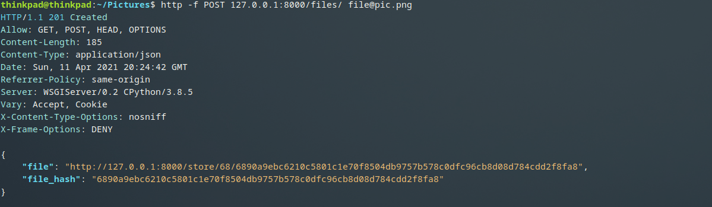
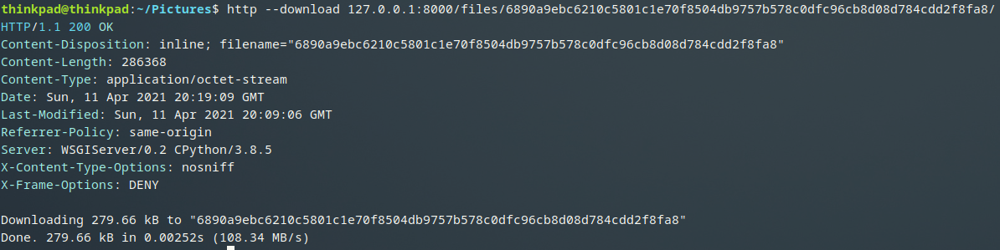
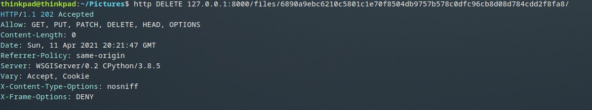

# file_storage
File storage with access via HTTP.

### `Описание`

Демон, предоставляющий HTTP API для загрузки, скачивание и удаления файлов. Файлы хранятся в подпапке проекта под названием `store`.
Имена файлов - это их хэш суммы, также они вложены в папки с именем первых двух символов хэша файла. Например:
имя файла (он же хеш файла) `dr2342...23dfe`, путь файла относительно папки с проектом `file_storage/store/dr/dr2342...23dfe`.

### `Подготовка к запуску`

Для запуска программы необходим `Python 3+`

Склонировать проект из репозитория: `git clone https://github.com/Glooshak/file_storage`

Перейти в папку с проектом: `cd file_storage/`, создать новое виртуально окружение `python3 -m venv venv`

Активировать виртуальное окружение `source venv/bin/activate`

После чего установить все необходимые зависимости командой `pip install -r requirements.txt`

В проекте присутствует `Makefile`, поэтому если у вас отсутствует утилита `make`, ее необходимо установить для дальнейших шагов

Запустите команду `make refresh_db` (инициализация и наполнение базы данных моделями)

Наконец для запуска приложения используйте следующую команду: `make start`

### `Использование`

Для проверки работоспособности программы необходим HTTP клиент. Рекомендую установить `HTTPie` (ссылка на сайт - `https://httpie.io/`).

Установка HTTP клиента на Debian, Ubuntu, etc. `apt install httpie`

1. Загрузка файла (upload): `http -f POST 127.0.0.1:8000/files/ file@[file_path]`

2. Скачивание файла (download): `http --download 127.0.0.1:8000/files/[file_hash]`

3. Удаление файла (deleting): `http DELETE 127.0.0.1:8000/files/[file_hash]`

